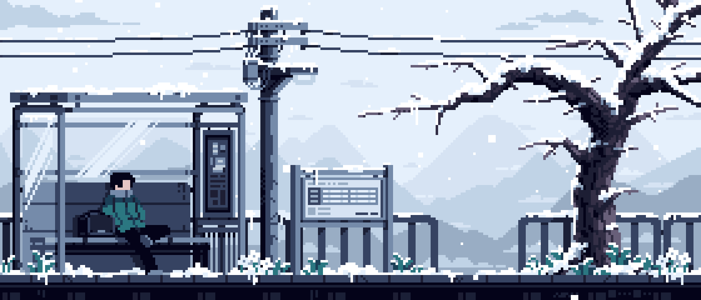

Hey there, I'm Parship 👋

I'm a final-year undergraduate who loves software engineering and open source. I graduated from the **CNCF** - Jaeger, **LFX Mentorship Program (Term 1, 2026)**. I enjoy building full-stack applications, contributing to impactful projects, and continuously learning new technologies.

You can explore my mentorship work and contributions [here](https://gist.github.com/parshipcy/5c32550b91da747c8efb3d9977f42b58)

Currently working on:
- Contributing to multiple open source projects
- Building full-stack applications with React, TypeScript and Node.js
- Learning system design, distributed systems, and AI-powered developer tools

---

Contributions:
- [JaegerTracing](https://github.com/jaegertracing/jaeger-ui/pulls?q=is%3Amerged+is%3Apr+assignee%3Aparshipcy+) → Contributed through features, refactoring, and bug fixes. Currently helping triage issues and in code reviews.
- [Twenty](https://github.com/twentyhq/twenty/pulls?q=is%3Amerged+is%3Apr+author%3Aparshipcy+) → Building features, fixing bugs, and improving the codebase.
- [Manufact](https://github.com/mcp-use/mcp-use/pulls?q=is%3Amerged+is%3Apr+author%3Aparshipcy+) → Fixing bugs and improving the codebase.
- [SugarLabs](https://github.com/sugarlabs/musicblocks/pulls?q=is%3Amerged+author%3Aparshipcy+is%3Aclosed+) → Fixing bugs and improving the codebase.

---

Tech Stack:

---

Connect with me:

